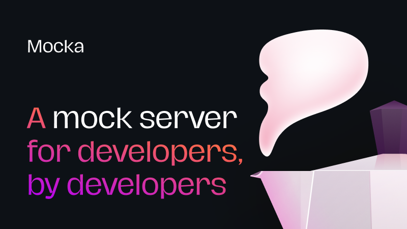

---

    <a href="#-features">Features</a> &bull;
    <a href="#-usage-requirements">Usage Requirements</a> &bull;
    <a href="#-build-requirements">Build Requirements</a> &bull;
    <a href="#-development">Development</a> &bull;
    <a href="#-known-issues">Known Issues</a> &bull;
    <a href="#-wanted-features">Wanted Features</a> &bull;
    <a href="#-changelog">Changelog</a> &bull;
    <a href="#-communication">Communication</a> &bull;
    <a href="#-contributing">Contributing</a> &bull;
    <a href="#-license">License</a>

---

Mocka — A Mock Server for Developers by Developers, made with Swift ❤️.

☕️ Getting Mocka
===============

To build it yourself or to contribute, look at the [Development](https://github.com/wise-emotions/mocka#-development) section for more information.

🚀 Features
===========

Here is the list of the most important currently implemented features:
- [x] Server section with a list for all the network exchanges automatically updated
- [x] API Editor included in the app
- [x] Console section with a list for all the logs automatically updated
- [x] Wildcard components in order to be able to define `*` paths
- [x] App fully written in Swift by using SwiftUI, Combine, and Vapor

If you want to see what's next, read the [Wanted Features](https://github.com/wise-emotions/mocka#-wanted-features) section.

You can also go to the [GitHub Project](https://github.com/wise-emotions/mocka/projects/1) board to see the Mocka backlog.

💻 Usage Requirements
=====================

| **Mocka** | **macOS** |
|-----------|-----------|
| 0.1.0     | 11.2      |

⚙️ Build Requirements
====================

| **Mocka** | **Swift** | **Xcode** |
|-----------|-----------|-----------|
| 0.1.0     | 5.3       | 12.4      |

🧑‍💻👩‍💻 Development
================

We currently use `XcodeGen` in order to generate the `.xcodeproj` file.
To install `XcodeGen` you will also need `brew`. If you currently don't have those software installed on your Mac, they will be automatically installed at the first run of `setup.sh`.

Currently, the `setup.sh` allows the following parameters:
- `close` to close the Xcode instance
- `format` to format all the code by using [`swift-format`](https://github.com/apple/swift-format)
- `clean` to clean the derived data (at the `.build` folder) and it also run an `xcodebuild clean` command
- `open` to open the Xcode project

For example you can type: `./setup.sh close clean open` to close the current Xcode instance, clean the project, and open the newly generated one.

🐛 Known Issues
===============

1. `testIsWorkspaceURLValidReturnsFalseForMissingServerConfiguration` in `Tests/AppTests/SettingsLogic+Test.swift` Unit Test sometimes fails 
2. The CI fails due to the lack of macOS 11 on GitHub Actions

If you find other issues, please [open a bug report](https://github.com/wise-emotions/mocka/issues).

If you would like to fix a bug, please follow the [Contributing](https://github.com/wise-emotions/mocka#-contributing) section.

🌈 Wanted Features
==================

The following list is not ordered, if you would like to see what will be included in the next release of Mocka, look at the [GitHub Project](https://github.com/wise-emotions/mocka/projects/1) board.

- Custom 4xx and 5xx Errors Support
- Automatic Updates
- Per-API Delay
- Allow Multiple Responses
- Responses Based on Query or Body
- Automatic Mock Data Generator
- Include SwiftGen for Localization
- Log Export
- Use SwiftNIO instead of Vapor
- Swagger Import
- Command Line Support

If you you would like to request another feature, please [open a feature request](https://github.com/wise-emotions/mocka/issues).

If you would like to add a feature, please follow the [Contributing](https://github.com/wise-emotions/mocka#-contributing) section.

📃 Changelog
============

To see what has changed in recent versions of Mocka, see the **[CHANGELOG.md](https://github.com/wise-emotions/mocka/blob/main/CHANGELOG.md)** file.

📣 Communication
================

- If you need help, open an issue.
- If you find a bug, open an issue.
- If you have a feature request, open an issue.
- If you want to contribute, see [Contributing](https://github.com/wise-emotions/mocka#-contributing) section.

💥 Contributing
===============

See [CONTRIBUTING.md](https://github.com/wise-emotions/mocka/blob/main/.github/CONTRIBUTING.md) file.

📄 License
==========

Mocka is available under the MIT license. See the **[LICENSE](https://github.com/wise-emotions/mocka/blob/main/LICENSE)** file for more info.
